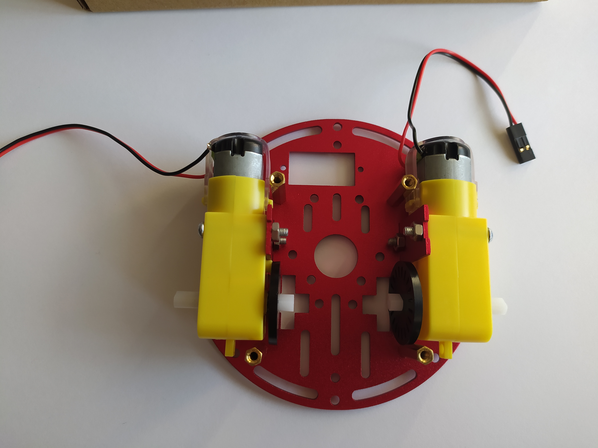
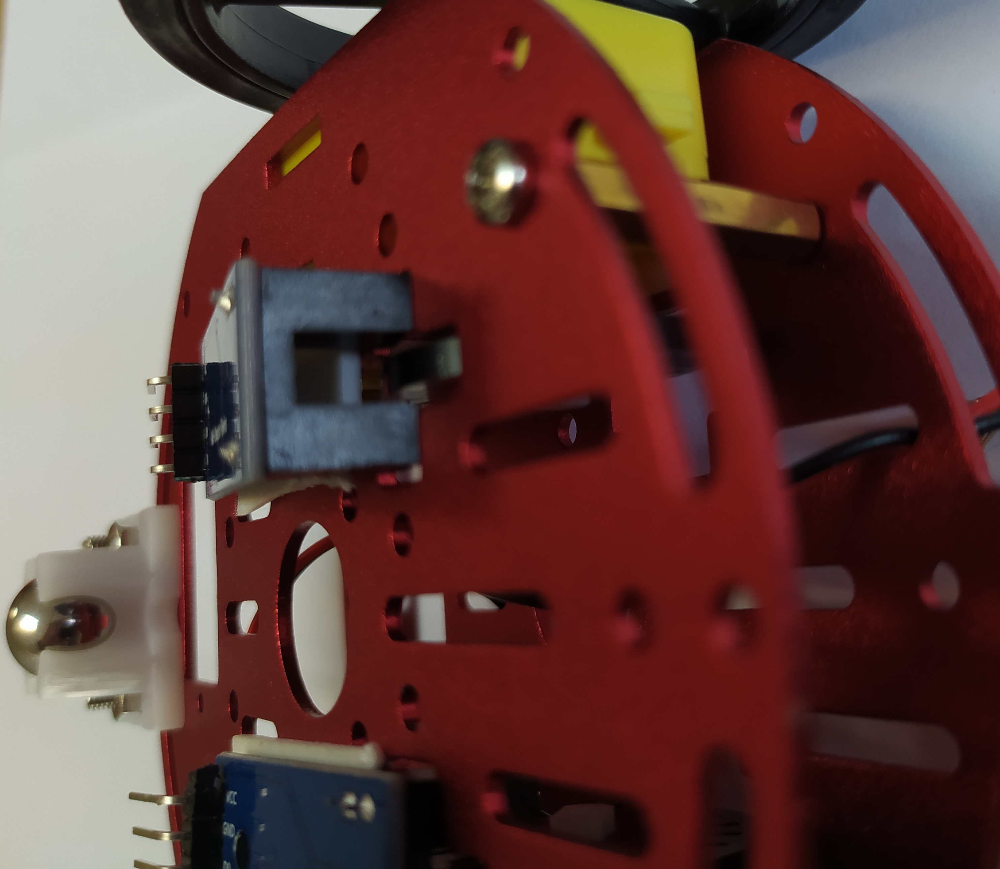
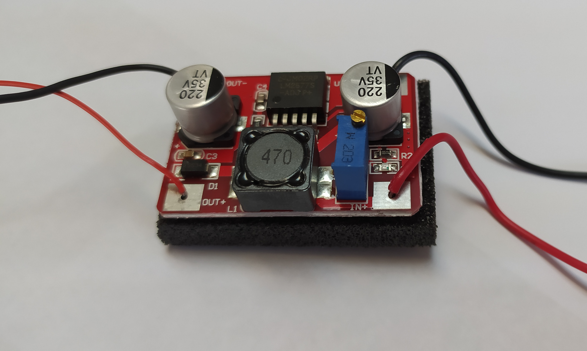
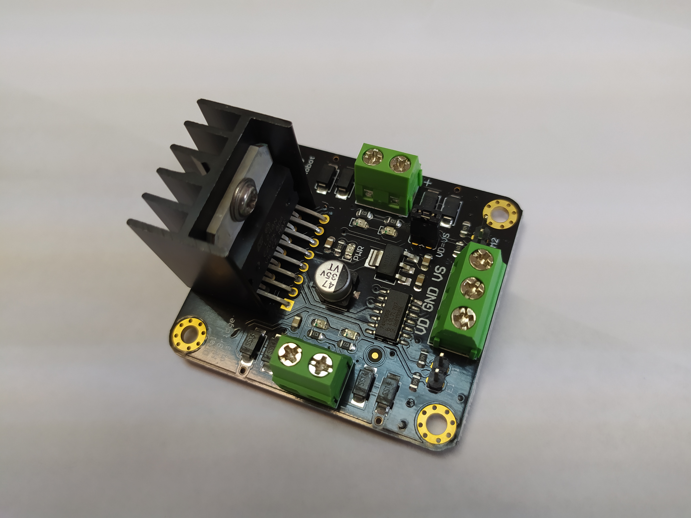
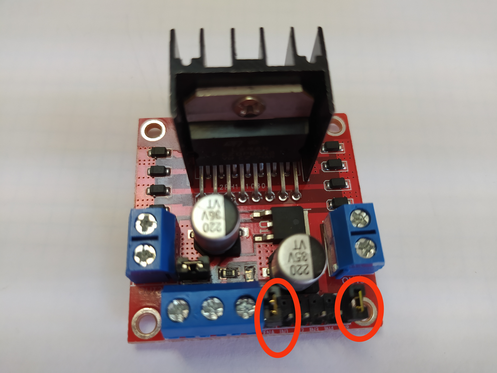
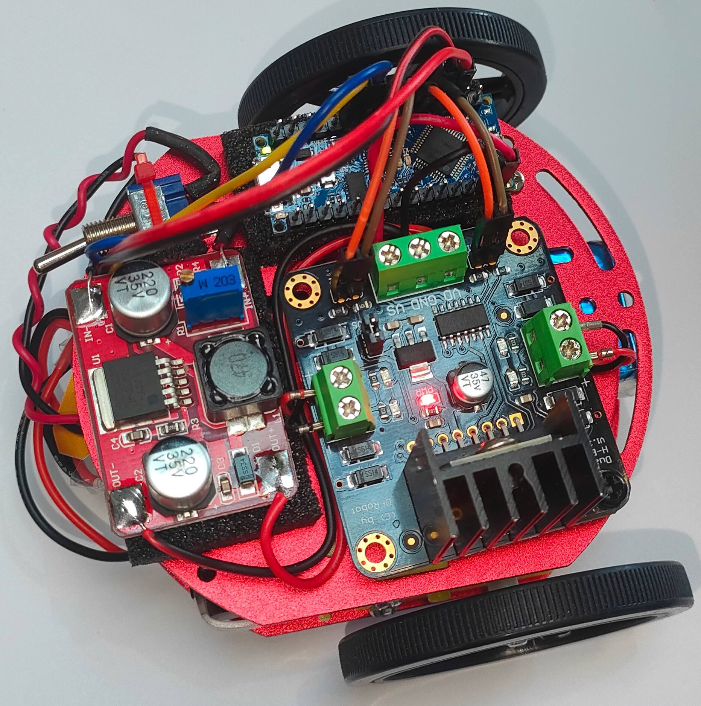
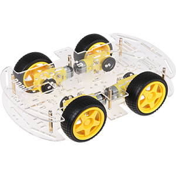

# IX Semana de la Informática. Concurso/Taller Robotarium - FDI

Bienvenidos al taller *Robotarium - FDI* y muchas gracias por colaborar en los primeros pasos de nuestro futuro *robotarium*.

Recuerda que si quieres obtener ECTS por participar en actividades de la Seamana de la Informática,
[debes inscribire en este formulario](https://web.fdi.ucm.es/ActividadesFormativas/). si no lo has hecho ya.

 

## Estructura del Taller

Este taller se compone de varias fases:
 
* `Construcción del robot` - En equipos de 3 personas, construiréis el robot y haréis que mueva sus ruedas.
* `Recorrer una distancia` - Programaréis el robot para que recorra una distancia predefinida.
* `Hacer un círculo` - Programaréis el robot para que recorra un círculo de 1m de radio. 
* `Hacer un cuadrado` - Programaréis el robot para que recorra un cuadrado. ¡Cuidado con las esquinas!

## Fase 1: Construcción del Robot

En esta primera etapa el objetivo es que montéis el chasis del robot y realicéis todas las conexiones necesarias para que el robot pueda mover las ruedas.
Para ello tendréis que seguir los siguientes pasos:

1. *Montar el chasis* con los motores, ruedas y rueda loca.
2. *Montar el sensor de odometría* para poder medir la distancia que recorre el robot.
3. *Conectar la alimentación*
4. *Conectar los motores* con la placa de control y el Arduino

Vamos paso a paso.

### Montar la el chasis rojo

En la caja de cartón tienes las piezas y tornillería necesarias para montar el chasis del robot. Sigue las instrucciones en papel que vienen en la caja.
El único paso que no figura en las instrucciones es la manera de colocar la rueda con agujeros que nos va a permitir detectar el movimiento de las ruedas usando el sensor de infrarrojos.


Al final de este paso vuestro robot se tiene que parecer a este


### Montar el sensor de infrarrojos para la odometría

Ahora toca montar los sensores de infrarrojos que van a detectar los agujeros de la rueda de plástico y de esta manera se podrán ir contando las vueltas que va dando cada una de las ruedas y así estimar la distancia que recorre cada rueda del robot.

Fijad los sensores con cinta de doble cara como se indica en las imágenes.




### Conectar la alimentación

Para alimentar toda la electrónica necesitamos un regulador de tensión. A la entrada de este regulador se conecta la batería y a la salida los pines de alimentación del Arduino.

!!! danger "Ajustar la tensión de salida"
	* Antes de conectar la salida del regulador a los pines de alimentación del Arduino hay que ajustar el valor de voltaje de salida. Para ajustarlo se usa el potenciómetro azul de la placa hasta que midas con el multímetro 8 voltios a la salida.



### Conectar la placa de control de los motores

Para poder accionar los motores se usa una placa controladora con un puente en H. A esta placa es a la que se conectan los motores y las salidas de Arduino con las que vamos a controlarlos.




!!!danger "Quita los jumpers que unen los pines ENA y ENB de la placa del puente en H"



Ya sólo queda colocar el Arduino, el interruptor y conectar correctamente entre ellos todos los sistemas.





|  Batería |   |
|---|---|
|Batería +   | Interruptor   |
|Batería -   | Regulador IN -   |

| Interruptor| |
|---|---|
| Interruptor 1 | Batería + |
|Interruptor 2 | Regulador IN +|

|Regulador| |
|---|---|
|In +| Interruptor 1|
|In -| Batería -|
|Out +| Puente en H VD|
|Out -| Puente en H GND|

|Puente en H | |
|---|---|
|GND| Regulador Out -|
|GND| Arduino GND  |
|+12| Arduino VIN|
|+12| Regulador Out +|
|ENA| Arduino D4|
|IN1| Arduino D2|
|IN2| Arduino D3|
|IN3| Arduino D5|
|IN4| Arduino D6|
|ENB| Arduino D7|
|OUT1| Motor1 +|
|OUT2| Motor1 -|
|OUT3| Motor2 +|
|OUT4| Motor2 -|


|Sensor Infrarrojo Derecho||
|---|---|
|VCC| Arduino Rst|
|GND| Arduino GND|
|D0| Arduino D6|

|Sensor Infrarrojo Izquierdo||
|---|---|
|VCC| Arduino Rst|
|GND| Arduino GND|
|D0| Arduino D7|

### Descargar el firmware del robot


Esto es un ejmplo de inclusión de una figura (puede ser .JPG, .PNG...)



## Ejemplo de código

```c
if (a==b)
    turn_right();
else
    turn_left();
```

## Cuadros de colores

!!! note "Cuestión"
    * ¿Qué componente se está incluyendo además de los que siempre se incluyen por defecto?
    * ¿Qué funcionalidad se importa de dicho componente?


!!! danger "Tareas"
    * Crea dos nuevos componentes en el proyecto creado a partir del ejemplo. Uno de ellos tendrá al menos una función `int get_hall_read()` que proporcionará una lectura del sensor de efecto Hall. El otro tendrá al menos una función `int get_temperature()` que deolverá la temperatura medida en grados Celsius obtenida del sensor Si7021. Los componentes podrán tener más funciones, tanto públicas como privadas. Antes de comenzar el REPL (que comienza con la llamada `esp_console_start_repl()`) se deberá mostrar por terminal una lectura de cada sensor.

