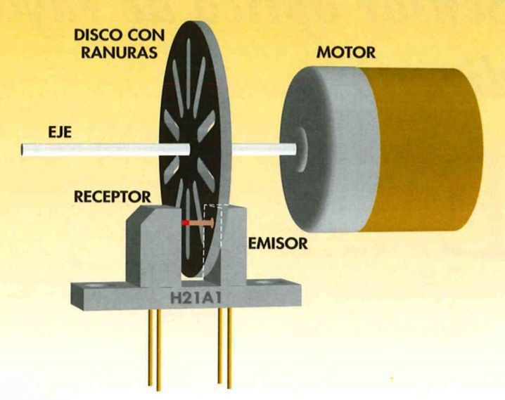

# IX Semana de la Informática. Concurso/Taller Robotarium - FDI

Bienvenidos al taller *Robotarium - FDI* y muchas gracias por colaborar en los primeros pasos de nuestro futuro *robotarium*.

Recuerda que si quieres obtener ECTS por participar en actividades de la Seamana de la Informática,
[debes inscribire en este formulario](https://web.fdi.ucm.es/ActividadesFormativas/). si no lo has hecho ya.

 
## Equipos participantes

Estos son los equipos participantes:

!!! danger "Equipos"
    |  Equipo  | NOMBRE   | PUNTOS | POSICIÓN |
    |---|---|---|---|
    |  Equipo 1 |    |  |  |
    |  Equipo 2 |   |  | |
    |  Equipo 3 |    | | |
    |  Equipo 4 |   | | |
    |  Equipo 5 |   | | |


|  Equipo 1 | NOMBRE   |
|---|---|
|Estudiante 1   |    |
|Estudiante 2   |    |
|Estudiante 3   |    |
|Puntos Misión 1   |    |
|Puntos Misión 2   |    |
|Puntos Misión 3   |    |
|Puntos Misión 4   |    |
|TOTAL   |    |


|  Equipo 2 | NOMBRE   |
|---|---|
|Estudiante 1   |    |
|Estudiante 2   |    |
|Estudiante 3   |    |
|Puntos Misión 1   |    |
|Puntos Misión 2   |    |
|Puntos Misión 3   |    |
|Puntos Misión 4   |    |
|TOTAL   |    |


|  Equipo 3 | NOMBRE   |
|---|---|
|Estudiante 1   |    |
|Estudiante 2   |    |
|Estudiante 3   |    |
|Puntos Misión 1   |    |
|Puntos Misión 2   |    |
|Puntos Misión 3   |    |
|Puntos Misión 4   |    |
|TOTAL   |    |


|  Equipo 4 | NOMBRE   |
|---|---|
|Estudiante 1   |    |
|Estudiante 2   |    |
|Estudiante 3   |    |
|Puntos Misión 1   |    |
|Puntos Misión 2   |    |
|Puntos Misión 3   |    |
|Puntos Misión 4   |    |
|TOTAL   |    |


|  Equipo 5 | NOMBRE   |
|---|---|
|Estudiante 1   |    |
|Estudiante 2   |    |
|Estudiante 3   |    |
|Puntos Misión 1   |    |
|Puntos Misión 2   |    |
|Puntos Misión 3   |    |
|Puntos Misión 4   |    |
|TOTAL   |    |

## Estructura del Taller

Este taller se compone de varias fases:
 
* `Construcción del robot` - En equipos de 3 personas, construiréis el robot y haréis que mueva sus ruedas.
* `Recorrer una distancia` - Programaréis el robot para que recorra una distancia predefinida.
* `Hacer un círculo` - Programaréis el robot para que recorra un círculo de 1m de radio. 
* `Hacer un cuadrado` - Programaréis el robot para que recorra un cuadrado. ¡Cuidado con las esquinas!

##  Misión 1: Construcción del Robot

!!! note "Misión 1"
    * Construye el robot y consigue que se muevan sus motores.
    * El primer equipo en lograrlo tendrá puntos extra.
    
    
En esta primera etapa el objetivo es que montéis el chasis del robot y realicéis todas las conexiones necesarias para que el robot pueda mover las ruedas.
Para ello tendréis que seguir los siguientes pasos:

1. *Montar el chasis* con los motores, ruedas y rueda loca.
2. *Montar el sensor de odometría* para poder medir la distancia que recorre el robot.
3. *Conectar la alimentación*
4. *Conectar los motores* con la placa de control y el Arduino


    
    
Vamos paso a paso.

### Montar la el chasis rojo

En la caja de cartón tienes las piezas y tornillería necesarias para montar el chasis del robot. Sigue las instrucciones en papel que vienen en la caja.
El único paso que no figura en las instrucciones es la manera de colocar la rueda con agujeros que nos va a permitir detectar el movimiento de las ruedas usando el sensor de infrarrojos.


Al final de este paso vuestro robot se tiene que parecer a este


### Montar el sensor de infrarrojos para la odometría

Ahora toca montar los sensores de infrarrojos que van a detectar los agujeros de la rueda de plástico y de esta manera se podrán ir contando las vueltas que va dando cada una de las ruedas y así estimar la distancia que recorre cada rueda del robot.

Fijad los sensores con cinta de doble cara como se indica en las imágenes.


### Conectar la alimentación

Para alimentar toda la electrónica necesitamos un regulador de tensión. A la entrada de este regulador se conecta la batería y a la salida los pines de alimentación del Arduino.

!!! danger "Ajustar la tensión de salida"
	* Antes de conectar la salida del regulador a los pines de alimentación del Arduino hay que ajustar el valor de voltaje de salida. Para ajustarlo se usa el potenciómetro azul de la placa hasta que midas con el multímetro 8 voltios a la salida.


### Conectar la placa de control de los motores

Para poder accionar los motores se usa una placa controladora con un puente en H. A esta placa es a la que se conectan los motores y las salidas de Arduino con las que vamos a controlarlos.


!!!danger "Quita los jumpers que unen los pines ENA y ENB de la placa del puente en H"


Ya sólo queda colocar el Arduino, el interruptor y conectar correctamente entre ellos todos los sistemas.


|  Batería |   |
|---|---|
|Batería +   | Interruptor   |
|Batería -   | Regulador IN -   |

| Interruptor| |
|---|---|
| Interruptor 1 | Batería + |
|Interruptor 2 | Regulador IN +|

|Regulador| |
|---|---|
|In +| Interruptor 1|
|In -| Batería -|
|Out +| Puente en H VD|
|Out -| Puente en H GND|

|Puente en H | |
|---|---|
|GND| Regulador Out -|
|GND| Arduino GND  |
|+12| Arduino VIN|
|+12| Regulador Out +|
|ENA| Arduino D6|
|IN1| Arduino D4|
|IN2| Arduino D5|
|IN3| Arduino D7|
|IN4| Arduino D8|
|ENB| Arduino D9|
|OUT1| Motor1 +|
|OUT2| Motor1 -|
|OUT3| Motor2 +|
|OUT4| Motor2 -|


|Sensor Infrarrojo Derecho||
|---|---|
|VCC| Arduino Rst|
|GND| Arduino GND|
|D0| Arduino D2|

|Sensor Infrarrojo Izquierdo||
|---|---|
|VCC| Arduino Rst|
|GND| Arduino GND|
|D0| Arduino D3|

### Descargar el firmware del robot

Ya lo tienes listo para descargar el firmware del robot y ¡¡empezar a programar!!
El código base necesario lo tienes disponible en [nuestro repo de github](https://github.com/tetuante/robotarium-fdi/tree/main/robotarium_code/agent)

Descárgalo y ábrelo con el IDE de Arduino. Verás que hay dos archivos:

+ **agent.ino** es el código principal de Arduino. Es en este archivo donde tienes las funciones principales que puedes usar y que os damos para facilitar la puesta en marcha y donde tendrás que escribir tu código.
+ **common.h** contiene las definiciones de variables y estructuras

Puedes conseguir que el robot mueva las ruedas usando las siguientes funciones:

```c
moveForward(const int pinMotor[3],int speed);
moveBackward(const int pinMotor[3],int speed);
fullStop(const int pinMotor[3]);
```
Esas tres funciones reciben como parámetro el array donde están almacenados los tres pines donde está conectado el motor (puedes verla definición en common.h). También reciben el parámetro speed, que es un entero entre 0 y 255 que indica la potencia que se quiere comandar al motor.

Así que sólo tienes que indicar el array del motor que quieres mover y la velocidad.

!!! danger "Atencion"
	* Los motores tienen una **zona muerta** ya que necesitan una potencia eléctrica mínima para comenzar a mover el eje,
	* La **zona muerta** es diferente para cada motor

!!! note "Misión 1"
    * ¿Tienes el robot completamente montado y logras mover ya los motores? Corre y enséñanoslo.
    * El primer equipo en conseguirlo tendrá 10 puntos, el siguiente 8, el tercero 6 etc...
    

## Misión 2: Recorrer 2m

!!! note "Misión 2"
    * Vuestra misión ahora es conseguir que el robot recorra 2m en línea recta
    * El equipo cuyo robot recorra la distancia de 2m con menos error recibirá 10 puntos, el segundo 8 y así sucesivamente.
    * Además el equipo que primero consiga recorrer 2m (más menos 20 cm) recibirá 2 puntos adicionales.
   
¿Os parece una misión sencilla? Tal vez no lo es tanto.

Para saber la distancia que ha recorrido el robot tendréis que usar los encoders. Nuestros enconders están formados por un sensor de infrarrojos y una rueda con ranuras  para cada rueda del robot. La  rueda con ranuras gira solidaria con la rueda del robot, de manera que el sensor de infrarrojos detecta el paso de las ranuras. Contando las ranuras que el sensor detecta en un tiempo determinado y conociendo el diámetro de las ruedas de nuestro robot podemos calcular la distancia que recorre cada rueda.



Puedes obtener las lecturas de los encoders de las dos ruedas leyendo las variables count_left_wheel y count_right_wheel que son actualizadas con la función update que se llama cada 100 ms.
Esta función actualiza también el valor de dt_s que es el tiempo transcurrido entre dos llamadas sucesivas

## Misión 3: Recorrer una trayectoria circular de radio 1m

!!! note "Misión 3"
    * Vuestra misión ahora es conseguir que el robot recorra una trayectoria circular de radio 1m moviéndose en el sentido de las agujas del reloj.
    * El equipo cuyo robot recorra el círculo con menos error recibirá 10 puntos, el segundo 8 y así sucesivamente.
    * Además el equipo que primero consiga recorrer el círculo con corrección recibirá 2 puntos adicionales.


## Misión 4: Recorrer una trayectoria cuadrada de lado 1m

!!! note "Misión final"
     * Esta es la misión más complicada. Vuestro robot deberá recorrer un cuadrado de 1m de lado en el sentido de las agujas del reloj.
     * El equipo cuyo robot recorra el cuadrado con menos error recibirá 10 puntos, el segundo 8 y así sucesivamente.
     * Además el equipo que primero consiga recorrer el cuadrado con corrección recibirá 2 puntos adicionales.

# Valoración del taller

!!! note "Encuesta"
     * Por favor, rellena la encuesta de valoración del taller antes de marcharte 
     * [Enlace a la encuesta](https://forms.gle/13VKj2Hnp82LM3ui7)
     
